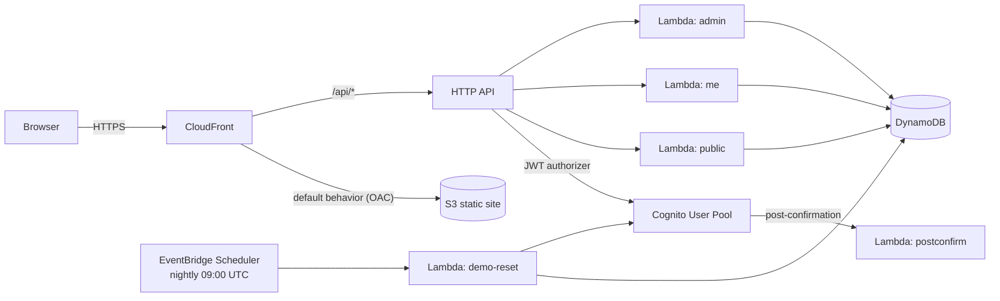

# Plank 1 — Modern Web Application Environment

**Alpenglow Permits** — a permit & licensing portal for the fictional City of Alpenglow, Colorado. A production-patterned, three-tier serverless web application that idles at ~$0 and stays live 24/7.

**Live:** https://permits.demos.planetek.org

## What it demonstrates

| Capability | Where to see it |
|---|---|
| Production web hosting (TLS, CDN, custom domain) | The site itself — S3 + CloudFront + OAC, ACM wildcard cert |
| Real authentication | Self-signup with email verification, SRP sign-in (Cognito) |
| Role-based access control | Guest / citizen / admin see different UI **and** different API responses |
| Defense in depth | JWT authorizer at the gateway, group checks in code, least-privilege IAM per Lambda |
| Data tier | DynamoDB single-table design with two GSIs, transactions, materialized counters |
| Operational hygiene | Nightly automated reset, API throttling, security headers, PITR |

## The three experiences

- **Guest (no sign-in):** browse the permit catalog, see the live transparency dashboard (`/stats`).
- **Citizen** (`citizen@demo.planetek.org` / `Alpenglow-Citizen1!`): submit applications via a 3-step wizard, track status through a visible event timeline.
- **Admin** (`admin@demo.planetek.org` / `Alpenglow-Admin1!`): work the review queue (start review / approve / deny with notes), see operational metrics, manage the permit catalog.

Demo credentials are intentionally public and printed on the sign-in page. A nightly EventBridge-scheduled Lambda wipes the table, reseeds deterministic demo data, re-asserts the demo accounts, and deletes any stranger sign-ups.

## Architecture



Same-origin API: the SPA calls `/api/*` on its own hostname — CloudFront routes it to API Gateway. No CORS anywhere. A CloudFront Function handles SPA deep links without breaking API error semantics.

**RBAC in layers:** unauthenticated routes are physically separate Lambda + read-only IAM role; citizen routes require a valid JWT; admin routes additionally require the `admin` group claim, enforced in code — and each Lambda's IAM role only permits the DynamoDB actions that function needs.

## Design

Each boardwalk plank carries its own visual identity; this one is "the counter at Town Hall" in a
Colorado mountain town. Every area of the portal is a numbered service window (Window 01 catalog,
02 records, 03 applications, 04 my applications, 05 staff), marked with counter-window plates.
Catalog cards read as job-site permit placards with a brass grommet, statuses render as reviewer
stamps, the application timeline uses trail-blaze diamonds, and a survey-tick alpenglow ridge band
closes the hero and tops the footer. Three type voices, all OFL and self-hosted via Fontsource:
[Fraunces](https://github.com/undercasetype/Fraunces) for display, Work Sans for body, DM Mono for
tracking IDs, dates, and readouts. Light mode grounds on pine-tinted paper; dark mode grounds on
spruce night via a retinted neutral scale. The strict CSP (`img-src 'self'`, `font-src 'self'`)
means every image and font ships from the site bucket — no CDNs, no third-party requests.

Photos are free-license images from Unsplash, resized and self-hosted:

- Hero — Telluride, CO box canyon by [Daniel Ribar](https://unsplash.com/photos/Momc9B6BmZ8)
- Transparency band — golden aspens by [Alex Moliski](https://unsplash.com/photos/128Xu1unqSg)
- Sign-in header — aspen grove by [Royce Fonseca](https://unsplash.com/photos/1KJgY_ABptY)

## Runbook

```sh
make deploy         # bundle backend + frontend, apply Terraform, publish, seed
make publish        # frontend + runtime config.json → S3, invalidate CloudFront
make seed           # reset demo data on demand (same code as the nightly run)
make verify         # 15 end-to-end checks: static, public API, auth, RBAC, round trip
make enable-domain  # attach permits.demos.planetek.org (after ACM cert is ISSUED)
make destroy        # tear the plank down (shared platform zone/cert stay)
```

First-time setup in a fresh account: `make bootstrap && make platform` at the repo root, add the printed NS records at the registrar, then `make deploy` here.

## Cost

| Component | Idle cost |
|---|---|
| S3, CloudFront, Lambda, DynamoDB, Cognito, API Gateway, Scheduler | $0 (free tier / pay-per-use) |
| Route53 hosted zone (shared by every plank) | $0.50/mo |
| **Total** | **≈ $0.50/mo + pennies of usage** |

No VPC, no NAT, no ALB, no always-on compute anywhere in this stack.
